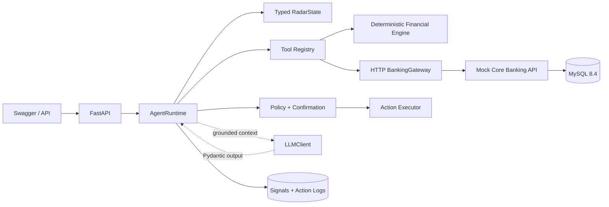

# MSB Financial Sensing

**Cố vấn Tài chính Đón đầu** is a proactive financial agent built around
`PREDICT → ADVISE → ACT`. It detects signals, forecasts risks, produces grounded
recommendations, prepares actions, enforces confirmation, executes business
tools, and records outcomes.

This is not a `FastAPI → LLM → text` wrapper. The MVP has typed state,
orchestration, a deterministic Financial Engine, tools, policy, confirmation,
execution, signal persistence, and action/tool-call tracing.

## Architecture



The lifecycle is:

```text
INIT → CONTEXT_READY → SIGNAL_DETECTED → ANALYSIS_READY
     → RECOMMENDATION_READY → ACTION_PREPARED
     → WAITING_CONFIRMATION → EXECUTING → EXECUTED → MONITORING
```

Informational flows may finish at `RECOMMENDATION_READY`. Invalid transitions,
including confirmation bypass, are rejected.

## Financial Engine versus LLM

The Financial Engine is the source of truth for anomaly percentages, recurring
dates, cashflow forecasts, goal gaps, scenario amounts, and budget guardrails.
It accepts an explicit `as_of` date and never imports an LLM.

The LLM may explain supplied evidence and select from valid options. It cannot
query the database, override policy, calculate financial metrics, or claim tool
success. `MockLLMClient` is used locally and in tests.

## Project structure

```text
financial-radar-service/
  app/                    Agent API, runtime, engine, tools and banking gateway
  tests/                  Agent, engine, policy and integration tests
  main.py                 Port-8080 AgentBase-compatible entrypoint
  Dockerfile              Financial Sensing image
mock-core-banking-service/
  corebanking/            Customer data and Core Banking business API
  tests/                  Core Banking API tests
  main.py                 Port-8090 entrypoint
  Dockerfile              Mock Core Banking image
frontend-mobile/
  src/                    Customer-facing Mobile Banking and Financial Sensing UI
  Dockerfile              Nginx frontend image
docker-compose.yml        MySQL + both backend services + frontend
```

## Data ownership

Mock Core Banking owns customers, accounts, transactions, recurring events,
budgets, saving goals, reminders, and idempotency records in MySQL 8.4.
Financial Sensing never queries those tables. It consumes typed context and applies
confirmed actions through the Core Banking REST API.

The Agent database owns only `radar_signals`, `agent_recommendations`, and
`agent_action_logs`. Recommendations store structured candidate plans and audit
decisions. Action logs include tool input/output, policy, confirmation, status,
latency, and the external Core Banking result.

## Setup and start

```powershell
python -m venv venv
venv\Scripts\Activate.ps1
pip install -r financial-radar-service/requirements-dev.txt
Copy-Item .env.example .env
docker compose up --build -d
```

Mobile Banking demo is at `http://localhost:3000`. Agent Swagger is at
`http://localhost:8080/docs`; Core Banking Swagger is at `http://localhost:8090/docs`.
Core Banking seeds C001-C004 once when its MySQL
database is empty.

- `C001`: cashflow risk—25m income, 9m balance, 3m safe balance, upcoming 6m
  rent, and historical discretionary spending.
- `C002`: FOOD spending 5m versus a three-month 4m baseline (+25%).
- `C003`: 100m/12-month goal with 22m progress around month four.
- `C004`: upcoming 8m rent against 7.2m balance, demonstrating
  `UPCOMING_RECURRING → CASHFLOW_RISK`.

## C001 hero demo

```json
POST /api/agent/run
{
  "customer_id": "C001",
  "message": "Tài chính tháng này của tôi thế nào?",
  "as_of": "2026-09-01"
}
```

`as_of` is optional. Production and Mobile Banking flows omit it so the Agent
uses the server's current date. Passing it explicitly is intended for
reproducible tests, historical analysis, and the documented C001-C004 fixture.

The response contains `recommendation_id`. Select the immutable stored option
without resending tool parameters:

```json
POST /api/agent/select
{"recommendation_id":"<returned-recommendation-id>","option_id":"A"}
```

The response is `WAITING_CONFIRMATION`; Financial Engine and MaaS are not rerun,
and no budget exists yet. Confirm:

```json
POST /api/agent/confirm
{"action_id":"<returned-action-id>","confirmed":true}
```

The resulting state is `MONITORING`, backed by actual tool output; this phase
records monitoring intent but does not start background jobs. For seeded
inputs, the forecast to 2026-09-15 is 1,366,667 VND, calculated from database
evidence rather than embedded as an output constant.

## MVP API

- `GET /api/customers/{customer_id}/snapshot`
- `GET /api/customers/{customer_id}/radar`
- `POST /api/tools/forecast-cashflow`
- `POST /api/tools/detect-spending-anomaly`
- `POST /api/tools/detect-recurring`
- `POST /api/tools/simulate-goal`
- `POST /api/actions/create-budget`
- `POST /api/actions/create-reminder`
- `POST /api/actions/update-goal`
- `POST /api/agent/run`
- `POST /api/agent/select`
- `POST /api/agent/confirm`
- `GET /api/agent/actions/{action_id}`
- `GET /api/customers/{customer_id}/signals`

Direct action endpoints use the same policy path. `create_budget` and
`update_goal` cannot execute before confirmation.

## Tests

```powershell
python -m pytest financial-radar-service/tests -q
python -m pytest mock-core-banking-service/tests -q
```

Tests require no real LLM and cover the engine, cross-signals, tool validation,
policy, transition safety, tracing, confirmation, persistence, and FastAPI E2E.

## LLM configuration

```dotenv
AGENT_RUNTIME=local
LLM_PROVIDER=greennode
LLM_BASE_URL=
LLM_API_KEY=
LLM_MODEL=
LLM_TIMEOUT_SECONDS=90
AGENT_RECOMMENDATION_TTL_SECONDS=900
```

Runtime placement and LLM provider are configured independently. With
`AGENT_RUNTIME=local`, `LLM_PROVIDER=mock` uses `MockLLMClient`, while
`LLM_PROVIDER=greennode` uses `GreenNodeLLMClient` against the real
OpenAI-compatible MaaS Chat Completions endpoint. `AGENT_RUNTIME=greennode`
requires the GreenNode provider and the same MaaS variables.
Installed GreenNode documentation does not guarantee `response_format=json_object`,
so the client uses strict JSON instructions followed by `json.loads`, Pydantic
validation, and bounded retries.

Business logic creates a fixed `CandidateActionPlan` first. MaaS may only return
the narrative summary, reasoning, and an existing `recommended_option_id`; the
server merges that decision with the original immutable action parameters.

## GreenNode AgentBase

The runtime factory supports both `LocalAgentRuntime` and
`GreenNodeAgentRuntime`. The latter is the Custom Agent container implementation:
AgentBase supplies hosting, lifecycle, IAM injection, endpoint, and platform-level
monitoring. The MSB application still owns the orchestration state machine,
Financial Engine, tools, policy/confirmation, persistence, and MaaS calls. Platform
IAM credentials are used by deployment skills/control-plane operations and are not
required for the FastAPI process to boot. Port 8080 and `GET /health` satisfy the
platform contract.

See [AgentBase deployment readiness](docs/AGENTBASE_DEPLOYMENT.md) for the
resource plan, remaining deployment choices, and cost considerations.

Secrets must stay in environment variables or AgentBase Identity and must never
be committed.

## Mock Core Banking service

Phase 1 of the customer-facing demo adds an independent FastAPI Core Banking
service under `corebanking/`. It owns synthetic customer, account, transaction,
budget, goal, recurring-event, and reminder data instead of making those tables
part of the agent boundary. Its local runtime database is MySQL 8.4.

```powershell
docker compose up --build corebanking
```

Open `http://localhost:8090/docs`. See
[Mock Core Banking service](docs/CORE_BANKING_DEMO.md) for API ownership,
idempotency, local execution, and the boundary of this phase.

Run the integrated local stack:

```powershell
docker compose up --build -d mysql corebanking financial-radar-agent
```

- Mobile Banking demo: `http://localhost:3000`
- Financial Sensing Agent: `http://localhost:8080/docs`
- Mock Core Banking: `http://localhost:8090/docs`

Financial Sensing reads all customer context and applies confirmed actions through
the Core Banking HTTP API. Its local database contains only signals,
recommendations, and action audit logs.
